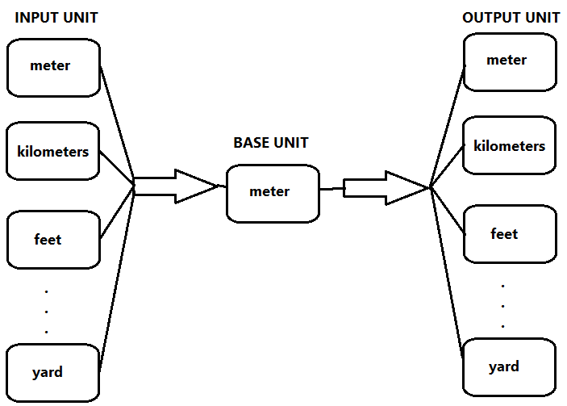
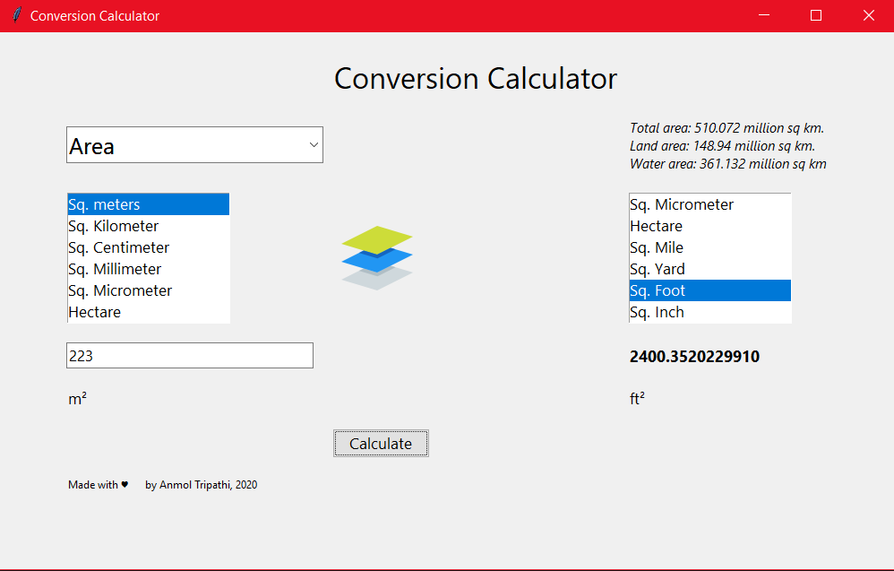
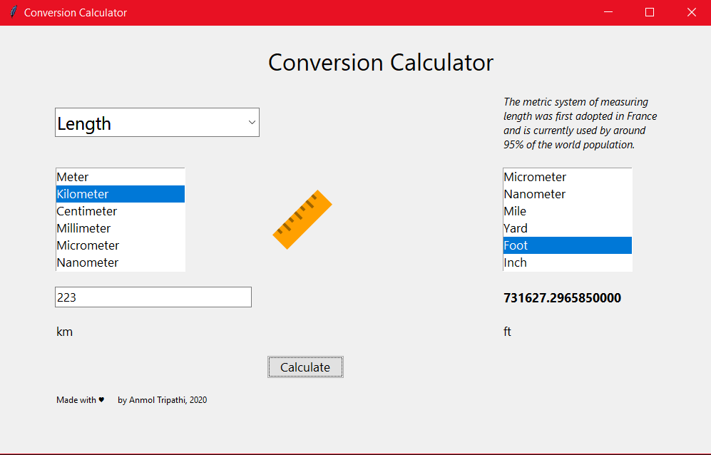

#Conversion Calculator- Basic
"> 

This is a basic conversion calculator made in Python and Tkinter.  
Conversions available for: 
* Length 
* Area 
* Volume 
* Temperature 
* Weight 

Executable build and msi setup file (for windows users) also included. 
 
### Conversion Working
For each meteric there is a base unit defined. Any unit selected first get converted into base unit and then to the desired unit. 

### Working Snaps
  

